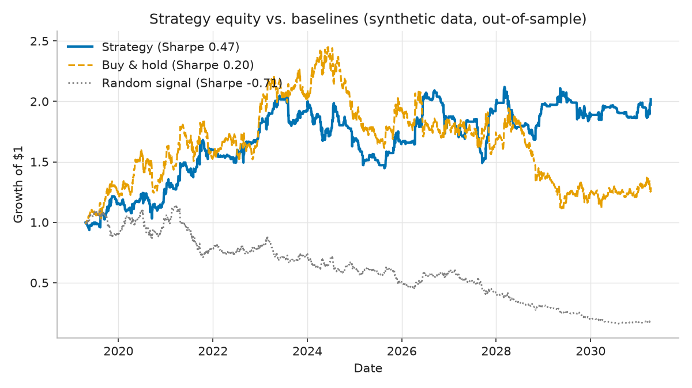
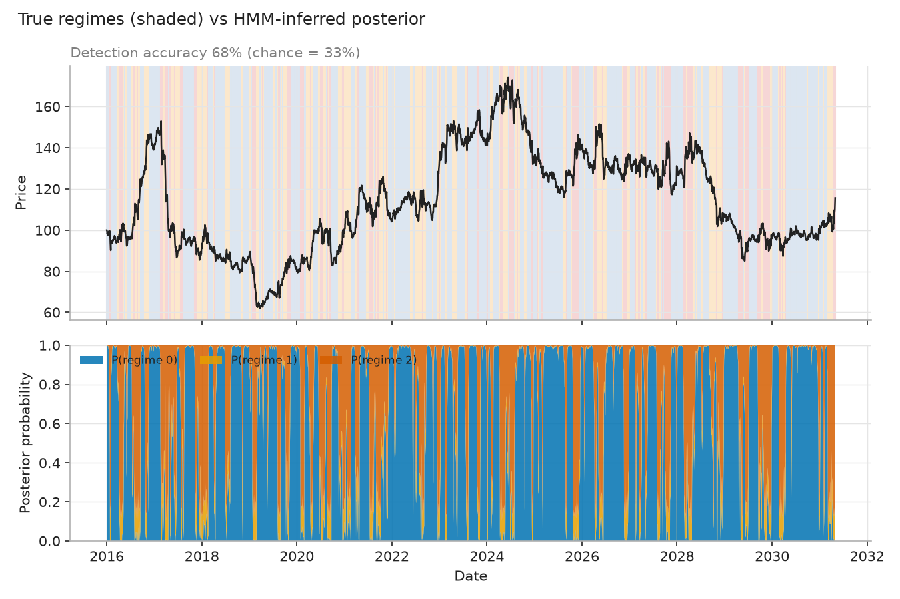
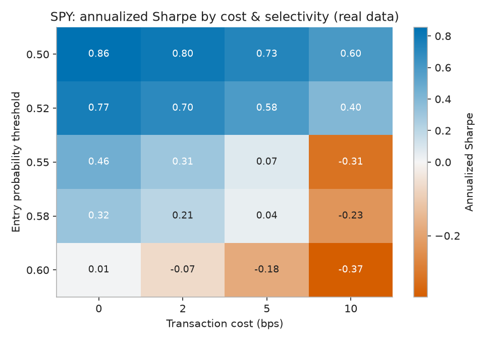
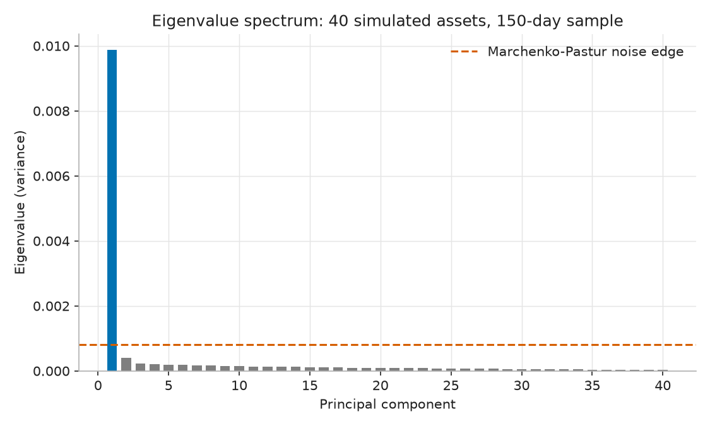

# Market Regime Signal Lab

[](https://github.com/zacka49/market-regime-signal-lab/actions/workflows/ci.yml)

A quantitative research pipeline covering stochastic-process simulation,
regime detection, alpha signal research, statistical rigor, and portfolio
construction — validated against ground truth wherever the design allows,
and tested honestly on real market data.

**Headline finding:** on real ETF data, the pipeline's walk-forward AUC
sits at 0.484–0.502 — indistinguishable from a coin flip. On synthetic
data (which has genuine structure by construction), the strategy beats
buy-and-hold and random-signal baselines, but its 90% bootstrap confidence
interval for Sharpe includes zero. **This project is not a profitable
trading strategy.** It's a demonstration of the research process that
finds that out rigorously rather than by accident — see
[`docs/research_report.md`](docs/research_report.md) for the full writeup.

## Why This Project Exists

Quantitative research work emphasises noisy data, time series, feature
engineering, model building, experiment design, and careful communication
of uncertainty — including negative results. This project is built to
demonstrate those skills end to end: simulation grounded in stochastic
calculus, regime detection scored against ground truth, an alpha-research
harness that correctly flags its own placebo signal as uninformative,
honest multiple-testing accounting, and portfolio-construction techniques
validated against a known true covariance.

## Results at a Glance

| | |
|---|---|
|  |  |
| Strategy beats both baselines on synthetic data, but its 90% bootstrap Sharpe CI **includes zero**. | A Gaussian HMM recovers the true hidden regime with **68% accuracy** (chance = 33%). |
|  |  |
| On real SPY data, Sharpe **collapses as the model gets more selective** — a symptom of noise, not skill. | PCA on a simulated multi-asset panel recovers the true market factor almost exactly (cosine similarity > 0.99). |

## What's Implemented

- **Stochastic simulation** (`sde.py`): Euler-Maruyama / Milstein
  discretization of GBM, Ornstein-Uhlenbeck, Heston stochastic volatility,
  and Merton jump-diffusion, each validated against a closed-form or
  near-closed-form target rather than just "runs without error."
- **Regime detection** (`regime_detection.py`, `filtering.py`): a Gaussian
  HMM and a from-scratch Hamilton filter, both scored against the
  simulator's ground-truth regime labels (accuracy, confusion matrix,
  detection lag) — not just fit and assumed sensible.
- **Alpha research** (`alphas.py`, `alpha_eval.py`): a small signal zoo
  (mean reversion, momentum, volatility-managed, regime-transition, and a
  placebo) through a standard IC/decile/turnover evaluation harness,
  including signal orthogonalization and combination.
- **Statistical rigor** (`evaluation.py`): baselines for every headline
  number, a stationary block bootstrap for confidence intervals and
  p-values (returns are serially dependent — an iid bootstrap would
  understate uncertainty), and a deflated Sharpe ratio accounting for every
  configuration actually tried.
- **Portfolio construction** (`portfolio.py`): PCA, Marchenko-Pastur
  eigenvalue denoising, and Ledoit-Wolf shrinkage (verified against
  scikit-learn to float precision) on a simulated factor panel with known
  true covariance, plus closed-form mean-variance / minimum-variance
  weights and a direct demonstration of naive mean-variance
  "error maximization."
- **Position sizing** (`sizing.py`): Kelly-criterion leverage (and why full
  Kelly is reckless in practice), fractional Kelly, and volatility
  targeting.
- **Real data** (`data.py`): the exact same pipeline, unchanged, run on
  five real ETFs via a cached `yfinance` loader.
- **Validation discipline**: leak-free feature engineering
  (`tests/test_no_lookahead.py` actively shocks future data and checks past
  features don't move), expanding-window walk-forward validation with an
  optional purge/embargo gap, and a full pytest suite (~97% coverage) run
  in CI on every push.

Every method above has a derivation in
[`docs/mathematical_notes.md`](docs/mathematical_notes.md), cross-linked to
the code that implements it — nothing there that can't be reproduced on a
whiteboard.

## Project Structure

```text
market-regime-signal-lab/
  README.md
  pyproject.toml
  streamlit_app.py
  assets/figures/          headline PNGs referenced in this README
  docs/
    mathematical_notes.md  derivations, cross-linked to code
    research_report.md     hypothesis -> method -> results -> limitations
  scripts/
    run_research.py             baseline synthetic pipeline
    run_regime_research.py      regime detection vs ground truth
    run_alpha_research.py       alpha signal evaluation harness
    run_statistical_rigor.py    baselines, bootstrap, deflated Sharpe
    run_portfolio_research.py   PCA / denoising / error maximization
    run_real_data_research.py   the honest real-ETF test
    generate_figures.py         regenerates assets/figures/*.png
  src/regime_signal_lab/
    simulate.py       discrete regime-switching simulator
    sde.py             continuous-time SDE simulation engine
    filtering.py        Hamilton filter
    regime_detection.py  HMM regime detection, scored vs ground truth
    features.py        leak-free feature engineering
    alphas.py            candidate alpha signal library
    alpha_eval.py        IC/decile/turnover evaluation harness
    model.py            walk-forward validation
    backtest.py          cost-aware backtest
    sizing.py             Kelly / vol-targeted position sizing
    evaluation.py        baselines, block bootstrap, deflated Sharpe
    portfolio.py         PCA, MP denoising, Ledoit-Wolf, portfolio weights
    data.py              synthetic + real (cached) data loading
  tests/                 ~97% coverage; see test_no_lookahead.py first
  .github/workflows/ci.yml
```

## Quick Start

```bash
python -m venv .venv
.venv\Scripts\activate
pip install -e ".[app,data,dev]"
pytest
python scripts/run_research.py
```

On macOS/Linux, use `source .venv/bin/activate` instead of the Windows
activation command.

Each `scripts/run_*.py` file is a self-contained research script; run any
of them directly (e.g. `python scripts/run_statistical_rigor.py`) to
reproduce the corresponding section of the research report. Real-data
scripts (`run_real_data_research.py`, `generate_figures.py`) need the
`data` extra (`pip install -e ".[data]"`) and network access on first run;
results are cached to `data/*.csv` afterward. `generate_figures.py` also
needs the `viz` extra (`pip install -e ".[viz]"`, matplotlib).

## Streamlit App

```bash
streamlit run streamlit_app.py
```

Interactive dashboard: change the simulation length, random seed, entry
threshold, and transaction-cost assumption, then inspect the market path,
HMM regime detection against ground truth, walk-forward model validation,
and the strategy equity curve.

## Research Notes

- A high in-sample score is not enough — every result here is walk-forward
  validated, and every headline metric is reported next to a baseline and
  a bootstrap confidence interval.
- Costs matter. A signal that looks attractive before costs can disappear
  — or go negative — after realistic transaction-cost assumptions (see the
  cost-sensitivity heatmap above).
- Multiple testing matters. Comparing several models/signals and reporting
  the best one inflates the apparent result; the deflated Sharpe ratio
  corrects for exactly how many things were actually tried.
- Ground truth, where available, is worth using. Because the simulator's
  regimes and portfolio-construction experiments have a known true answer,
  every estimator in this project (HMM regime labels, PCA factor loadings,
  covariance denoising) is scored against that truth rather than just
  assumed to be reasonable.

See [`docs/research_report.md`](docs/research_report.md) for the full
results writeup and [`docs/mathematical_notes.md`](docs/mathematical_notes.md)
for every derivation behind the code.
